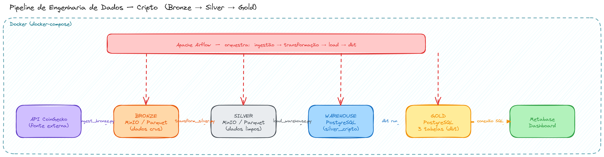
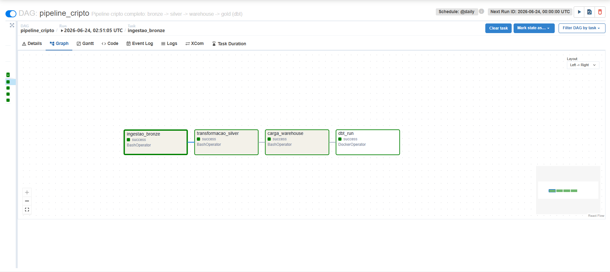
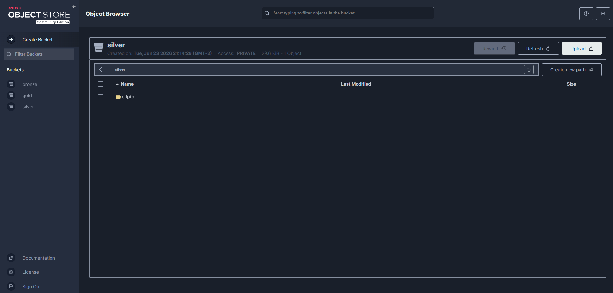
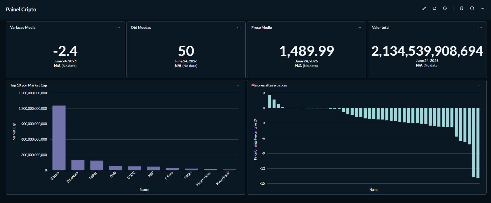

# 🪙 Pipeline de Engenharia de Dados — Criptomoedas

Pipeline de dados **ponta a ponta**, construído 100% com tecnologias open source rodando localmente via Docker. O projeto extrai dados de criptomoedas de uma API pública, processa-os pela **arquitetura medalhão** (bronze → silver → gold) e os disponibiliza num dashboard analítico — tudo orquestrado automaticamente pelo Apache Airflow.

---

## 🏗️ Arquitetura

```
API CoinGecko → BRONZE → SILVER → WAREHOUSE → GOLD → Dashboard
  (fonte)      (Parquet) (Parquet) (PostgreSQL) (dbt)  (Metabase)
```

| Camada        | Onde             | O que contém                                                                   |
| ------------- | ---------------- | ------------------------------------------------------------------------------ |
| **Bronze**    | MinIO (Parquet)  | Dados crus da API, sem transformação                                           |
| **Silver**    | MinIO (Parquet)  | Dados limpos: colunas padronizadas, duplicatas e estruturas aninhadas tratadas |
| **Warehouse** | PostgreSQL       | Silver carregada em tabela relacional                                          |
| **Gold**      | PostgreSQL (dbt) | Tabelas modeladas em SQL prontas para análise                                  |

> Diagrama completo da arquitetura disponível em [`docs/arquitetura.png`](docs/arquitetura.png).



---

## 🛠️ Stack utilizada

| Tecnologia                          | Papel no projeto                            |
| ----------------------------------- | ------------------------------------------- |
| **Docker / Docker Compose**         | Orquestração de toda a infraestrutura local |
| **Python (pandas, requests, s3fs)** | Ingestão e transformação de dados           |
| **MinIO**                           | Data lake compatível com S3                 |
| **Apache Airflow**                  | Orquestração do pipeline (LocalExecutor)    |
| **PostgreSQL**                      | Data warehouse                              |
| **dbt**                             | Modelagem da camada gold em SQL             |
| **Metabase**                        | Visualização e dashboards                   |

---

## 📊 Fluxo de dados detalhado

1. **Ingestão (bronze)** — `ingest_bronze.py` consome a [API da CoinGecko](https://www.coingecko.com/en/api) e grava o JSON cru em Parquet no MinIO, particionado por data.
2. **Transformação (silver)** — `transform_silver.py` lê o bronze, padroniza nomes de colunas, remove duplicatas e achata estruturas aninhadas (ex: campo `roi`), gravando o resultado limpo no MinIO.
3. **Carga no warehouse** — `load_warehouse.py` carrega a silver numa tabela do PostgreSQL (estratégia _truncate + append_ para preservar objetos dependentes).
4. **Modelagem (gold)** — o **dbt** transforma os dados em três modelos analíticos:
   - `gold_top_market_cap` — top 10 moedas por valor de mercado
   - `gold_variacao_preco` — maiores altas e baixas em 24h
   - `gold_metricas_diarias` — métricas agregadas por dia
5. **Visualização** — o **Metabase** conecta ao warehouse e exibe os dados em dashboards.

Todo o fluxo é orquestrado por uma DAG do Airflow, na ordem:

```
ingestao_bronze → transformacao_silver → carga_warehouse → dbt_run
```

A última etapa usa o `DockerOperator`, com o Airflow disparando o container do dbt — um padrão comum em ambientes de produção.

---

## 📁 Estrutura do projeto

```
projeto-data-enginner/
├── dags/
│   └── pipeline_cripto.py        # DAG de orquestração
├── ingestion/
│   └── ingest_bronze.py          # extração da API → bronze
├── spark/
│   └── transform_silver.py       # bronze → silver
├── warehouse/
│   └── load_warehouse.py         # silver → PostgreSQL
├── dbt/
│   ├── dbt_project.yml
│   ├── profiles.yml
│   └── models/
│       ├── staging/
│       │   ├── sources.yml
│       │   └── stg_cripto.sql
│       └── gold/
│           ├── gold_top_market_cap.sql
│           ├── gold_variacao_preco.sql
│           └── gold_metricas_diarias.sql
├── docker/
│   └── dbt.Dockerfile
├── docs/                         # diagramas e screenshots
├── docker-compose.yml
└── README.md
```

---

## 🚀 Como executar

### Pré-requisitos

- Docker e Docker Compose instalados

### Passos

**1. Suba a infraestrutura:**

```bash
docker compose up -d
```

**2. Construa a imagem do dbt:**

```bash
docker compose build dbt
```

**3. Acesse as interfaces:**

| Serviço  | URL                   | Credenciais                |
| -------- | --------------------- | -------------------------- |
| Airflow  | http://localhost:8080 | admin / admin              |
| MinIO    | http://localhost:9001 | minioadmin / minioadmin123 |
| Metabase | http://localhost:3000 | (criar no primeiro acesso) |

**4. Execute o pipeline:**

No Airflow, ative a DAG `pipeline_cripto` e dispare manualmente (▶), ou aguarde o agendamento diário. As quatro tasks rodam em sequência automaticamente.

---

## 🖼️ Screenshots

### Pipeline orquestrado no Airflow

As quatro tasks executando em sequência, todas com sucesso:



### Camadas de dados no MinIO

Os buckets bronze, silver e gold com os arquivos Parquet particionados:



### Dashboard no Metabase

Visualização das tabelas gold — top moedas, variação de preço e métricas diárias:



---

## 💡 Conceitos demonstrados

- **Arquitetura medalhão** (bronze/silver/gold) para organização progressiva dos dados
- **Orquestração** de pipeline com Apache Airflow e dependências entre tasks
- **Orquestrador disparando containers** via `DockerOperator` (Airflow → dbt)
- **ELT moderno**: transformação dentro do warehouse com dbt e SQL
- **Data lake + Data warehouse** num mesmo fluxo
- **Infraestrutura como código** com Docker Compose

---

## 📌 Possíveis evoluções

- Testes de qualidade de dados (testes nativos do dbt, Great Expectations)
- CI/CD com GitHub Actions (lint + testes)
- Substituição do Parquet puro por Delta Lake ou Apache Iceberg
- Migração para nuvem (AWS S3 + Snowflake/BigQuery) provisionada com Terraform
- Ingestão em tempo real com Kafka

---

_Projeto desenvolvido para estudo de engenharia de dados ponta a ponta._
